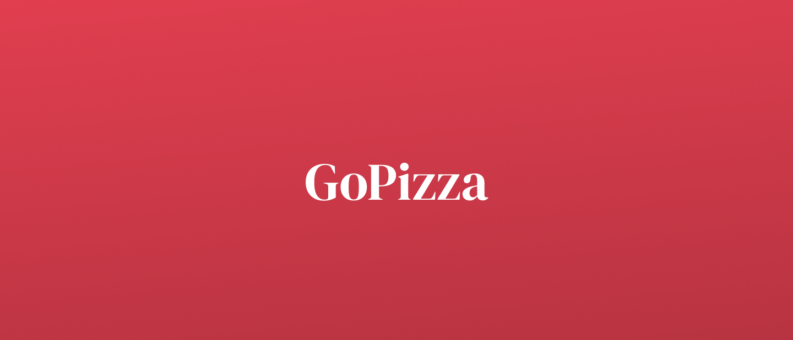

<h1 align="center">
    
</h1>

<h2 align="center">🚧 This project is under construction 🚧</h2>
<h4 align="center">as soon as it is finished I will post it here 😄</h4>

 

# License

This project is under MIT license . [See it](https://github.com/saymon-araujo/goPizza/blob/main/LICENSE) for more information.

---

Being made by Saymon Araújo

 
 Feel free to get in touch, it will be a pleasure to chat.

  
  
  &nbsp;&nbsp;&nbsp;&nbsp;

